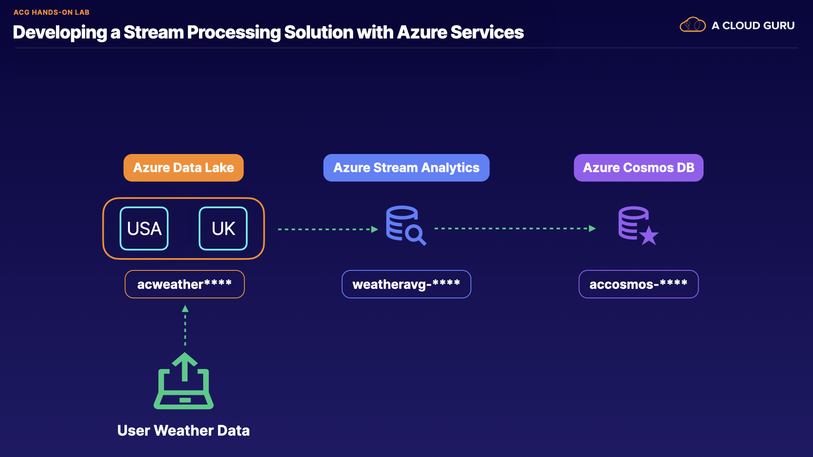

# Developing a Stream Processing Solution with Azure Services


## Introduction


In this hands-on lab scenario, you are a data engineer for Awesome Company. You have been tasked with creating a stream processing solution in Azure that will analyze crowdsourced weather information and provide running averages. Previously, you have provisioned an Azure Data Lake Storage Gen2 account to hold the uploaded files, and now you need to configure the appropriate Azure services to both view and store the average temperatures per country in near-real time. Performing the actions of this hands-on lab will help you become familiar with building a complete stream processing solution using Azure services.



## Simulate Data Uploads

1. In the Azure portal, click the provisioned acweather storage account to open it.
2. Copy the acweather storage account name and paste it into a text file for later use.
3. On the left menu under Settings, click Access keys.
4. Click Show keys.
5. Beneath key1, click the copy icon and paste the key into a text file for later use.
6. From the top menu, click the Cloud Shell icon (>_).
7. Click PowerShell.
8. Click Show advanced settings.
9. Use the same location as your lab provided resource group.
10. For Storage account, select Create new and enter a unique name.
11. For File share, select Create new and enter "acshell".
12. Click Create storage.
13. Get the script used to generate our weather data:
```
wget https://raw.githubusercontent.com/linuxacademy/course-dp203-data-engineering-on-microsoft-azure/main/Hands-on%20Labs/file_creator.ps1 file_creator.ps1
```
14. Add our storage account parameters to the weather data script, replacing <"STORAGE_ACCOUNT_NAME"> and <"STORAGE_ACCOUNT_KEY"> with the previously copied values:
```
./file_creator.ps1 -storageAccountName <"STORAGE_ACCOUNT_NAME"> -storageAccountKey <"STORAGE_ACCOUNT_KEY">
```
15. To verify our weather data is being created in the Azure portal, click Containers under Data Lake Storage.
16. Select uk1 or usa to view the container data.

## Process Streaming Data with Azure Stream Analytics

1. In the Azure portal, return to the Resource group page and click the provisioned weatheravg Stream Analytics job.
2. On the left under Job topology, click Inputs.
3. Click + Add stream input > Blob storage/ADLS Gen2.
4. On the right, set the following values:
* Input alias: uk-weather-files
* Storage account: acweather<UNIQUE_STRING>
* Container: uk1
* Authentication mode: Connection string


5. Leave the rest as their defaults and click Save.
6. Repeat the process above to add a stream input for the usa container with an input alias of usa-weather-files.
7. On the left, click Outputs.
8. Click + Add > Cosmos DB.
9. On the right under Output alias, enter "weather-avg".
10. Leave the rest as their defaults and click Save

## Verify the Data

1. On the left under Job topology, select Query.
2. In the query window, paste in the following query:

```
SELECT System.Timestamp() AS OutTime, country, AVG(high) AS High, AVG(low) AS Low
FROM [uk-weather-files] uk
GROUP BY country, TumblingWindow(minute,3)
UNION
SELECT System.Timestamp() AS OutTime, country, AVG(high) AS High, AVG(low) AS Low
FROM [usa-weather-files] us
GROUP BY country, TumblingWindow(minute,3)
```

3. Click Test query and view the results.
4. Return to the main Stream Analytics job page and click Start.
5. On the bottom right, click Start.
6. Once started, click the resource group name at the top of the page.
7. Click the provisioned Azure Cosmos DB account.
8. On the left, click Data Explorer.
9. Under SQL API, click acweather > weather-avg > Items.
10. Select one of the items to view the country's weather average data stored in Cosmos DB.
11. Wait 3 minutes and click the refresh icon to view the latest data results.